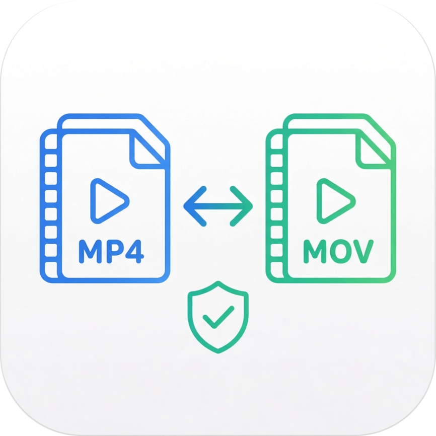
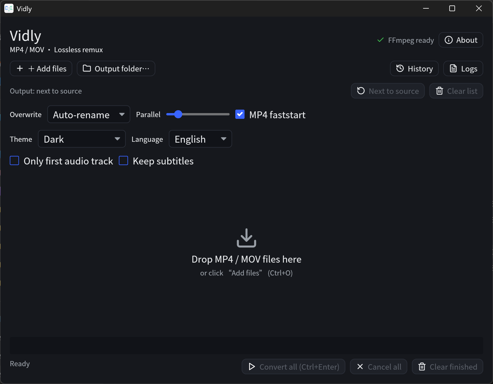
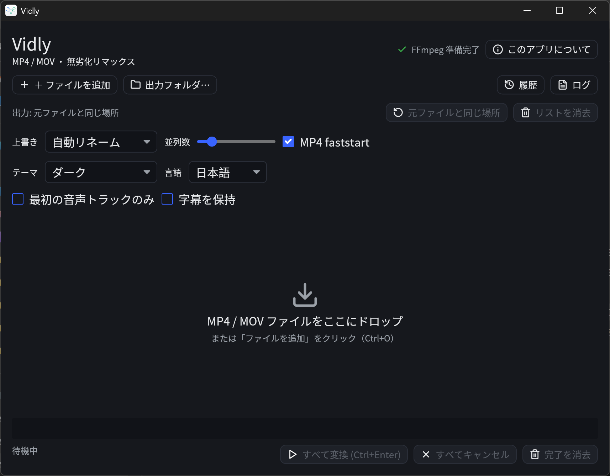
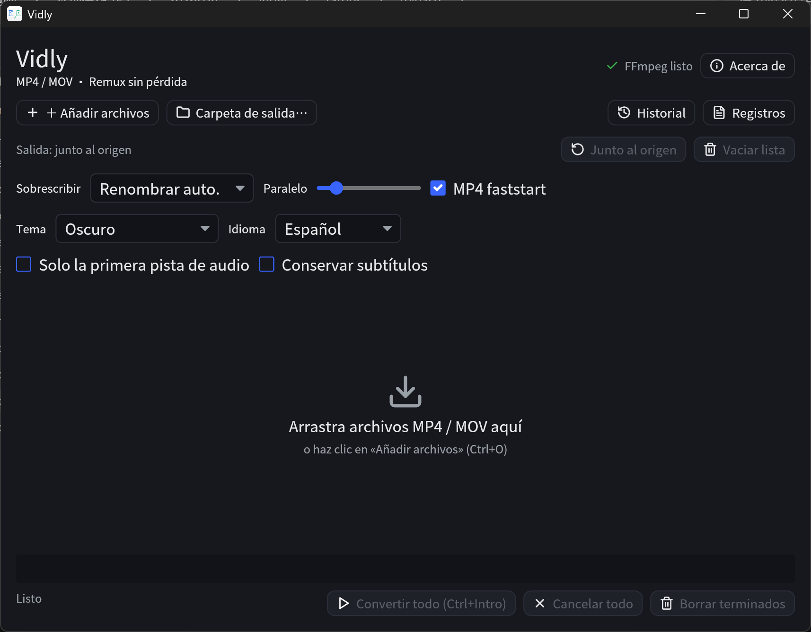

<div align="center">



# Vidly

**Lossless MP4 ⇄ MOV converter for Windows, macOS & Linux.**
Remux only — no re-encoding. Same quality, near file-copy speed.

[](https://github.com/indmak/vidly/releases)
[](LICENSE)
[](#download)
[](#languages)
[](https://www.indmak.com/products/vidly)

[**Website**](https://www.indmak.com/products/vidly) ·
[**Download**](#download) ·
[**Features**](#features) ·
[**Build**](#build-from-source) ·
[**Docs**](docs/)

</div>



## Why Vidly?

MP4 and MOV are close relatives — both are ISO Base Media (QuickTime) containers.
Converting between them usually means **swapping the container, not the codec**.
Vidly uses FFmpeg's stream copy (`-c copy`) to move the audio/video streams into
the new container untouched: **mp4 to mov** and **mov to mp4**, losslessly and at
near file-copy speed.

- **Truly lossless** — video and audio bitstreams are never re-encoded.
- **Fast** — a multi-GB file remuxes in seconds.
- **Batch queue** — drag in files or whole folders; convert several at once.
- **Per-file target** — pick MP4 / MOV / MKV / WebM per item in the queue.
- **Stream control** — keep only the first audio track; optionally keep subtitles.
- **Dark / light / follow-system theme.**
- **8 languages** — follows your system locale, falls back to English.
- **Batteries included** — the installer ships FFmpeg and skips it if you already have one.
- **No uploads, no accounts** — everything runs locally on your machine.

## Features

| | |
|---|---|
| **Lossless remux** | `-c copy` only — no quality loss, no re-encode |
| **Batch & parallel** | queue multiple files, 1–8 concurrent conversions |
| **Cancel anytime** | per item or all at once |
| **Drag & drop** | drop files or whole folders; auto-expand + de-duplicate |
| **Output control** | custom output folder, auto-rename / overwrite / skip |
| **faststart** | `+faststart` for MP4/MOV streaming playback |
| **History & logs** | recent conversions + rotating diagnostic logs |
| **Formats** | MP4, MOV, M4V, MKV, WebM |

## Screenshots

Vidly is fully localized — the same tool in different languages:

| English | 日本語 | Español |
|---|---|---|
|  |  |  |

## Download

| Platform | Package | Link |
|---|---|---|
| Windows | `Vidly-Setup-<ver>.exe` | [GitHub Releases](https://github.com/indmak/vidly/releases) · [Microsoft Store](https://apps.microsoft.com/) *(coming soon)* |
| macOS | `Vidly-<ver>.dmg` | [GitHub Releases](https://github.com/indmak/vidly/releases) |
| Linux | `vidly_<ver>_amd64.deb` | [GitHub Releases](https://github.com/indmak/vidly/releases) |

Official site: **https://www.indmak.com/products/vidly**

## Usage

1. Add files with **Add files** (`Ctrl+O`) or drag MP4 / MOV / MKV / WebM files (or folders) into the window.
2. Each item gets a **target container** (default: MP4→MOV, MOV→MP4, MKV/WebM→MP4) — change it per file with the dropdown on the right.
3. Pick an output directory, or leave it to write next to the source file.
4. Choose an overwrite policy and concurrency.
5. Press **Convert all** (`Ctrl+Enter`), then **Open** to reveal a finished file.

The header shows whether FFmpeg was detected. The installer bundles an LGPL
FFmpeg and installs it only if you don't already have `ffmpeg` / `ffprobe` on
PATH; otherwise install FFmpeg or place both binaries next to the Vidly
executable. (macOS/Linux packages always bundle it.)

## Languages

English · Français · Deutsch · Español · Русский · 日本語 · 한국어 · 简体中文

Follows the system locale; unknown locales fall back to English. Change it anytime
in the settings row.

## Privacy

Vidly runs entirely on your machine and makes **no network requests**. Your
settings, conversion history and diagnostic logs are stored locally under your
user config directory (`%APPDATA%\vidly` on Windows, `~/.config/vidly` on Linux,
`~/Library/Application Support/vidly` on macOS). Logs and history record local
file paths in plain text — delete that folder to clear them.

## Tech stack

Vidly is built with Rust and a small, focused set of libraries:

| Layer | Technology | Links |
|---|---|---|
| Language | **Rust** | [rust-lang.org](https://www.rust-lang.org/) |
| GUI | **iced** (Elm architecture) | [iced.rs](https://iced.rs/) |
| Async runtime | **Tokio** | [tokio.rs](https://tokio.rs/) |
| Conversion engine | **FFmpeg** (subprocess, `-c copy`) | [ffmpeg.org](https://ffmpeg.org/) |
| File dialogs | **rfd** | [github.com/PolyMeilex/rfd](https://github.com/PolyMeilex/rfd) |
| Config / history | **Serde** + serde_json | [serde.rs](https://serde.rs/) |
| Errors | **thiserror** | [github.com/dtolnay/thiserror](https://github.com/dtolnay/thiserror) |
| Logging | **tracing** + tracing-appender | [github.com/tokio-rs/tracing](https://github.com/tokio-rs/tracing) |
| System theme | **dark-light** | [github.com/frewsxcv/rust-dark-light](https://github.com/frewsxcv/rust-dark-light) |
| System locale | **sys-locale** | [github.com/1Password/sys-locale](https://github.com/1Password/sys-locale) |
| UI font | **Noto Sans CJK SC** | [github.com/notofonts/noto-cjk](https://github.com/notofonts/noto-cjk) |
| Icons | **Lucide** (SVG) | [lucide.dev](https://lucide.dev/) |

## Build from source

Requires a recent stable Rust toolchain and FFmpeg on `PATH` for local runs.

```bash
cargo build --release
cargo run
```

Offline / behind a firewall — the wrapper probes the network and only falls back
to a local proxy when direct access fails:

```powershell
# Windows (proxy defaults to http://127.0.0.1:3128, override with $env:VIDLY_PROXY)
powershell -ExecutionPolicy Bypass -File scripts/dev.ps1 run
```

```bash
# macOS / Linux
cargo test
```

## Packaging & releases

Pushing a `v*` tag triggers [`.github/workflows/release.yml`](.github/workflows/release.yml),
which builds all three platforms on GitHub-hosted runners, signs/notarizes (when
secrets are configured), and publishes to GitHub Releases. See
[`docs/开源打包构建.md`](docs/开源打包构建.md) and
[`docs/macOS 签名配置.md`](docs/macOS 签名配置.md).

- `installer.iss` — Windows Inno Setup installer (bundles FFmpeg, skips if present)
- `scripts/build-ffmpeg-min.sh` — minimal LGPL FFmpeg for all platforms
- `scripts/package-macos.sh` / `scripts/package-deb.sh` — macOS DMG / Debian package
- `scripts/make-icons.ps1` / `scripts/make-icns.sh` — icon generation

## Roadmap

- [x] Batch queue, cancel, drag & drop
- [x] Dark / light / follow-system theme
- [x] 8-language i18n
- [x] Conversion history & rotating logs
- [x] Per-item target container (MP4 / MOV / MKV / WebM)
- [ ] Microsoft Store listing
- [ ] Flathub / Snap packages

## Contributing

Issues and pull requests are welcome. Please run `cargo test` before opening a PR
and keep changes focused.

## License

This project is licensed under the [MIT License](LICENSE).
This software uses [FFmpeg](https://ffmpeg.org), distributed as an independent
binary and invoked as a separate process. The bundled builds are minimal,
self-compiled **LGPL v2.1+** builds (`--disable-gpl`, remux only) — see
[`scripts/build-ffmpeg-min.sh`](scripts/build-ffmpeg-min.sh). The license text
ships inside every package (see [LICENSE-ffmpeg.txt](LICENSE-ffmpeg.txt)).
You may replace the bundled FFmpeg binaries with your own build at any time.
The UI embeds [Noto Sans CJK SC](https://github.com/notofonts/noto-cjk) under the
SIL OFL 1.1 (see [`assets/fonts/OFL.txt`](assets/fonts/OFL.txt)). Full third-party
notices: [THIRD_PARTY.md](THIRD_PARTY.md).

<div align="center">

Made with Rust &amp; iced · [indmak.com/products/vidly](https://www.indmak.com/products/vidly)

</div>
